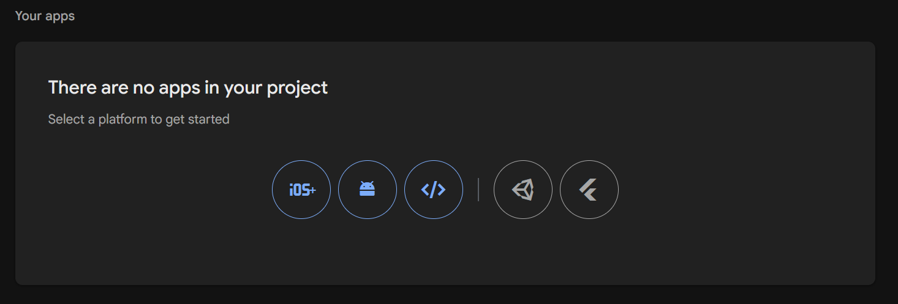
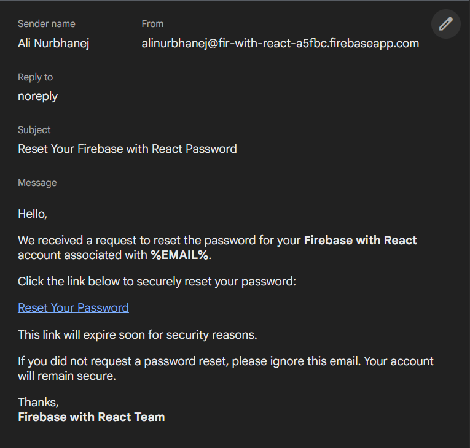

##### SetUp Firebase Project. #####

◉ Open  https://firebase.google.com  --> go to fundamentals --> Add Firebase - Web. 

◉ First we create firebase project folder in vs code. Then click the below link and follow the instructions.

## https://firebase.google.com/docs/web/setup  Documentation link for setup. ##

1. Create a Firebase project.

2. Register your app. ---> Aana mate go to firebase console --> open firebase project --> firebase project settings --> general tab --> niche last heading hse   ema web select krvanu.

3. App nu name aapvanu je project nu name hoy e.

4. npm install firebase

5. Copy code like this and paste into folder name -> config/firebase.js <- file name.

<!--! Aama bdhi values .env file ma rakhvani -->

import { initializeApp } from "firebase/app";

const firebaseConfig = {
  apiKey: import.meta.env.VITE_FIREBASE_API_KEY,
  authDomain: import.meta.env.VITE_FIREBASE_AUTH_DOMAIN,
  projectId: import.meta.env.VITE_FIREBASE_PROJECT_ID,
  messagingSenderId: import.meta.env.VITE_FIREBASE_MESSAGING_SENDER_ID,
  appId: import.meta.env.VITE_FIREBASE_APP_ID,

  //? For realtime database
  databaseURL: import.meta.env.VITE_FIREBASE_DATABASE_URL,

  //? For file storage
  storageBucket: import.meta.env.VITE_FIREBASE_STORAGE_URL,
};

const app = initializeApp(firebaseConfig);

//? Create realtime database instance
export const realTimeDB = getDatabase(app);

//? Create authentication instance
export const auth = getAuth(app);

//? Create firestore database instance
export const db = getFirestore(app);

//? Create storage instance
export const storage = getStorage(app);

6. Continue to the console.

7. Setup is completed. --> Go to Project Dashboard and Use any services.

##### Services #####

### Authentication ###

1. Open  https://firebase.google.com/docs/auth/web/start

2. Create instance of authentication firebase config file and export it.

<!--* import { getAuth } from "firebase/auth"; -->

<!--* export const auth = getAuth(app); -->

<!--! When project is live then go to Authentication --> Settings --> Authorised domains --> Add domain --> localhost to live url of project -->

## For Signup user with email and password, go to SignUp.jsx file ##

https://firebase.google.com/docs/auth/web/start#sign_up_new_users

## For Signup user with email, password and verify email, go to SignUp.jsx file ##

https://firebase.google.com/docs/auth/web/manage-users#send_a_user_a_verification_email

Sender name :- Company_Name
From :- Company_Name
Subject :- Verify your email for Project_Name 

## For SignIn user with email and password, go to Login.jsx file ##

https://firebase.google.com/docs/auth/web/start#sign_in_existing_users

## For Reset Password, go to Login.jsx ##

https://firebase.google.com/docs/auth/web/manage-users#send_a_password_reset_email

Sender name :- Company_Name
From :- Company_Name
Subject :- Reset Your Password – Project_Name 
Message :- 
Hello,

  

  We received a request to reset the password for your
  <strong>Project_Name</strong> account associated with
  <strong>%EMAIL%</strong>.
  

  

  Click the link below to securely reset your password:
  

  

  <a href="%LINK%" style="color:#1a73e8; font-weight:600;">
  Reset Your Password
  </a>
  

  

  This link will expire soon for security reasons.
  

  

  If you did not request a password reset, please ignore this email.
  Your account will remain secure.
  

  

  Thanks, 
  <strong>Project_Name Team</strong>
  

## For Logout user, go to Home.jsx ##

onAuthStateChanged() -->  https://firebase.google.com/docs/auth/web/start#set_an_authentication_state_observer_and_get_user_data

SignOut(auth) -->  https://firebase.google.com/docs/auth/web/password-auth#next_steps

## For Signup / SignIn user with phone number, go to SignUp.jsx or Login.jsx file ##

https://firebase.google.com/docs/auth/web/phone-auth

## For Signup / SignIn user with google, go to SignUp.jsx or Login.jsx file ##

https://firebase.google.com/docs/auth/web/google-signin

## For Signup / SignIn user with facebook, go to SignUp.jsx or Login.jsx file ##

https://firebase.google.com/docs/auth/web/facebook-login

◉ Go to -->  https://developers.facebook.com

1. Create App
2. App Name
3. Select Authenticate and request data from users with Facebook Login
4. Select I don't want to connect a business portfolio yet
5. Then click Next until Go to dashboard appears.
6. App Settings --> Basic --> Show App ID & App secret
7. Go to Dashboard --> Click Customize the Authenticate and request data from users with Facebook Login use case
8. Go to Permissions and features --> Add email
9. Go to Settings --> Scroll down --> Valid OAuth Redirect URIs --> Paste url from Firebase Authentication (Facebook provider)
10. Save changes

## For Signup / SignIn user with github, go to SignUp.jsx or Login.jsx file ##

https://firebase.google.com/docs/auth/web/github-auth

◉ Client ID & Client secret :- Go to GitHub settings --> Developer Settings --> New GitHub App

1. GitHub App name 
2. Homepage URL --> like  http://localhost:5173 or website domain
3. Callback URL --> Add the callback URL from Firebase Authentication (GitHub provider) here
4. Webhook --> Deactivate the active checkbox
5. Select Only on this account
6. Create GitHub App
7. Show Client ID:
8. Generate a new client secret and copy it
9. Paste both url in Firebase Authentication (GitHub provider)
10. Click outside the Client secret box --->  Save
11. <!--! Change  **Homepage URL**  localhost to live url when project is live -->

## For Signup / SignIn user with apple ##

https://firebase.google.com/docs/auth/web/apple

## For Signup / SignIn user with twitter ##

https://firebase.google.com/docs/auth/web/twitter-login

### Realtime Database ###

1. Open  https://firebase.google.com/docs/database/web/start

2. Go to firebase console --> Build --> open realtime database service.

3. Create Database

4. Select location of database --> Singapore (asia-southeastl)

5. Start in Test mode

6. Go to documentation --> databaseURL: key copy and paste into firebase config file under appId and its value is --> go to firebase console --> open realtime database and show link of database --> copy it and paste in front of databaseURL:  

7. Create instance of realtime database in firebase config file and export it.

<!--* import { getDatabase } from "firebase/database"; -->

<!--* export const db = getDatabase(app); -->

8. Scroll down --> Read and write data. -->  https://firebase.google.com/docs/database/web/read-and-write

# For Read / Write Real Time Data, go to RealTimeDatabase.jsx file #

### Firestore Database ###

1. Open  https://firebase.google.com/docs/firestore/quickstart

2. Go to firebase console --> Build --> open firestore database service.

3. Create Database

4. Select location of database --> ex: mubmai

5. Start in Test mode 

6. Create instance of firestore database in firebase config file and export it.

<!--* import { getFirestore } from "firebase/firestore"; -->

<!--* export const db = getFirestore(app); -->

7. Write data -->  https://firebase.google.com/docs/firestore/quickstart#add_data

8. Read data there are three types: single data, all collection data & condition based data. -->  https://firebase.google.com/docs/firestore/quickstart#read_data

9. Update Data -->  https://firebase.google.com/docs/firestore/manage-data/add-data#update-data

10. Delete Data -->  https://firebase.google.com/docs/firestore/manage-data/delete-data#delete_documents

11. Timestamp -->  https://firebase.google.com/docs/firestore/manage-data/add-data#server_timestamp

12. Show Timestamp date in code using .toDate(). --> like product.createdAt.toDate()

# For CRUD Operation, go to CRUD.jsx & FireStoreDatabase.jsx file #

### Storage ###

1. Open  https://firebase.google.com/docs/storage/web/start#create-default-bucket

2. Go to firebase console --> Build --> open firebase storage service.

3. Create Storage

4. Select location of database --> ex: US-CENTRAL1

5. Start in Test mode 

6. Create instance of firebase storage in firebase config file and export it.

<!--* import { getStorage } from "firebase/storage"; -->

<!--* export const storage = getStorage(app); -->

7. Create reference  https://firebase.google.com/docs/storage/web/create-reference#create_a_reference

8. Upload file  https://firebase.google.com/docs/storage/web/upload-files#upload_from_a_blob_or_file

9. Create URL  https://firebase.google.com/docs/storage/web/download-files#download_data_via_url

# For Upload Data in Storage, go to FireStoreDatabase.jsx file #

### Cloud Messaging ###

1. Open  https://firebase.google.com/docs/cloud-messaging/web/get-started

2. Go to firebase console --> Run --> open cloud messaging service.

3. Create your first campaign

4. Firebase Notification messages

<!--* import { getMessaging } from "firebase/messaging"; -->

<!--* export const messaging = getMessaging(app); -->

5. Go to firebase console --> Project settings --> Cloud Messaging --> Generate key pair

6. Add cloud messaging key in vapidKey.

7. Foreground messages -->  https://firebase.google.com/docs/cloud-messaging/web/receive-messages#foreground-messages

8. Background messages -->  https://firebase.google.com/docs/cloud-messaging/web/receive-messages#set-notification-options-sw

# For cloud messaging, go to Home.jsx file #