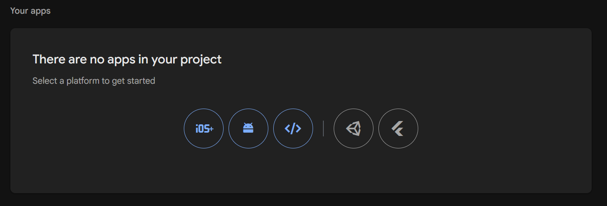

##### SetUp Firebase Project. #####

◉ Open  https://firebase.google.com  --> go to fundamentals --> Add Firebase - Web. 

◉ First we create firebase project folder in vs code. Then click the below link and follow the instructions.

## https://firebase.google.com/docs/web/setup  Documentation link for setup. ##

1. Create a Firebase project.

2. Register your app. ---> Aana mate go to firebase console --> open firebase project --> firebase project settings --> general tab --> niche last heading hse   ema web select krvanu.

3. App nu name aapvanu je project nu name hoy e.

4. npm install firebase

5. Copy code like this and paste into folder name -> config/firebase.js <- file name.

<!--! Aama bdhi values .env file ma rakhvani -->

import { initializeApp } from "firebase/app";

const firebaseConfig = {
  apiKey: "",
  authDomain: "",
  projectId: "",
  storageBucket: "",
  messagingSenderId: "",
  appId: ""
};

const app = initializeApp(firebaseConfig);

6. Continue to the console.

7. Setup is completed. --> Go to Project Dashboard and Use any services.

##### Services #####

### Realtime Database ###

1. Open  https://firebase.google.com/docs/database/web/start

2. Go to firebase console --> build --> open realtime database service.

3. Create Database

4. Select location of database --> Singapore (asia-southeastl)

5. Start in Test mode

6. Go to documentation --> databaseURL: key copy and paste into firebase config file under appId and its value is --> go to firebase console --> open realtime database and show link of database --> copy it and paste in front of databaseURL:  

7. Create instance of realtime database in firebase config file and export it.

<!--* import { getDatabase } from "firebase/database"; -->

<!--* export const db = getDatabase(app); -->

8. Scroll down --> Read and write data. -->  https://firebase.google.com/docs/database/web/read-and-write

## For Write Data go to App.jsx file ##

### Authentication ###

1. Open  https://firebase.google.com/docs/auth/web/start

2. Create instance of authentication firebase config file and export it.

<!--* import { getAuth } from "firebase/auth"; -->

<!--* export const auth = getAuth(app); -->

## For Signup / SignIn data with email and password go to App.jsx file ##

https://firebase.google.com/docs/auth/web/password-auth

## For Reset Password go to App.jsx ##

https://firebase.google.com/docs/auth/web/manage-users#send_a_password_reset_email

## For Signup / SignIn data with phone number go to App.jsx file ##

https://firebase.google.com/docs/auth/web/phone-auth

## For Signup / SignIn data with google go to App.jsx file ##

https://firebase.google.com/docs/auth/web/google-signin

## For Signup / SignIn data with facebook go to App.jsx file ##

https://firebase.google.com/docs/auth/web/facebook-login

## For Signup / SignIn data with github go to App.jsx file ##

https://firebase.google.com/docs/auth/web/github-auth

## For Signup / SignIn data with apple go to App.jsx file ##

https://firebase.google.com/docs/auth/web/apple

## For Signup / SignIn data with twitter go to App.jsx file ##

https://firebase.google.com/docs/auth/web/twitter-login